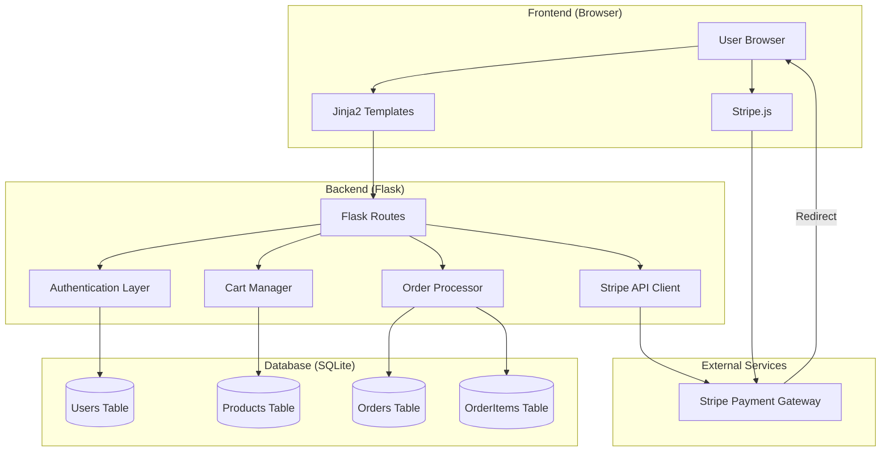
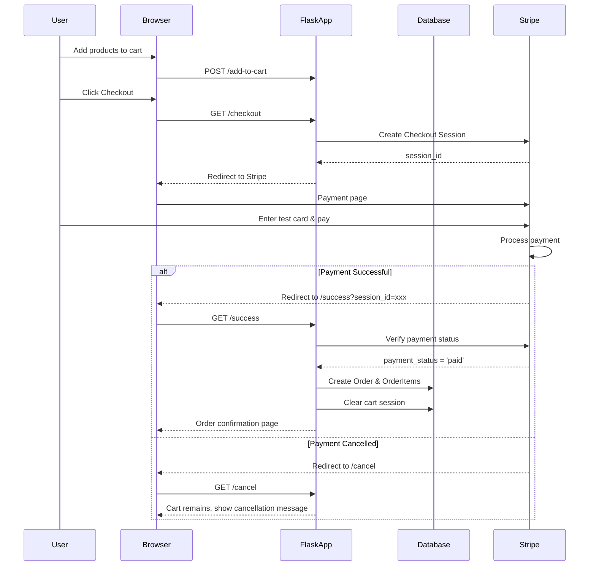
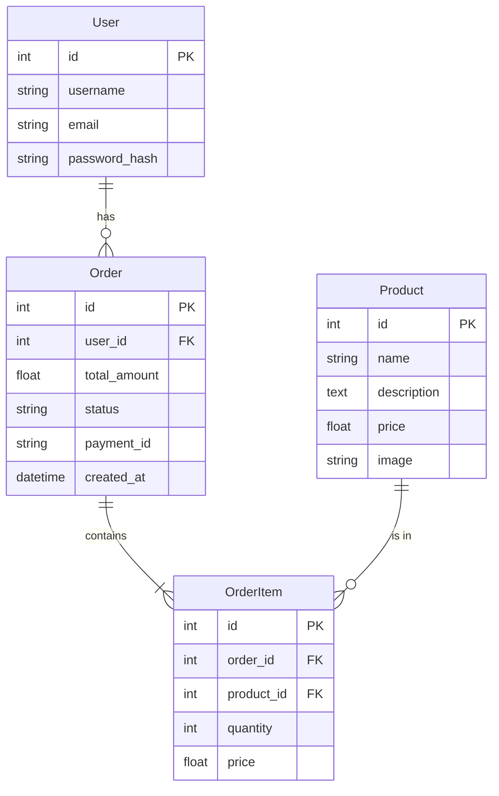

```markdown
# 🛒 Flask E-Commerce Website with Stripe Payment

A complete, production-ready e-commerce web application built with **Python Flask** framework. The primary focus is on **secure online payment processing** using **Stripe Checkout** (sandbox mode). The project implements clean architecture, authentication, cart management, order processing, and admin dashboard.


---

## 📋 Table of Contents
- [Features](#-features)
- [System Architecture](#-system-architecture)
- [Tech Stack](#-tech-stack)
- [Payment Flow Diagram](#-payment-flow-diagram)
- [Project Structure](#-project-structure)
- [Installation & Setup](#-installation--setup)
- [Environment Variables](#-environment-variables)
- [Database Setup](#-database-setup)
- [Running the Application](#-running-the-application)
- [Testing Payment](#-testing-payment)
- [API Endpoints](#-api-endpoints)
- [Security Features](#-security-features)
- [Logging & Monitoring](#-logging--monitoring)
- [Troubleshooting](#-troubleshooting)
- [Deployment](#-deployment)
- [Future Enhancements](#-future-enhancements)
- [License](#-license)

---

## ✨ Features

### 👤 Authentication System
- User registration with password hashing (Flask-Bcrypt)
- Secure login/logout (Flask-Login)
- Protected routes (checkout requires authentication)
- Session management with CSRF protection

### 🛍️ Product Management
- Product catalog with name, description, price, and image
- Product listing and detail pages
- Cart system with add/remove/update quantity
- Cart stored in Flask session (JSON format)

### 💳 Payment Processing (Main Focus)
- Full integration with **Stripe Checkout** (sandbox mode)
- Realistic payment flow:
  - Create Stripe Checkout Session
  - Redirect to Stripe's hosted payment page
  - Handle success/cancel webhooks
  - Verify payment status before creating order
- Order creation only after successful payment
- Idempotency check (prevents duplicate orders)
- Payment status tracking (Pending/Paid/Failed)

### 🔧 Bonus Features
- Admin dashboard to view all orders
- Payment status badges
- Comprehensive logging system
- Sample data seeder

---

## 🏗️ System Architecture



---

## 🛠️ Tech Stack

| Category | Technology | Version |
|----------|-----------|---------|
| **Backend** | Python | 3.9+ |
| **Framework** | Flask | 2.3.3 |
| **Database** | SQLite + SQLAlchemy ORM | 3.1.1 |
| **Authentication** | Flask-Login + Flask-Bcrypt | 0.6.2 / 1.0.1 |
| **Payment** | Stripe API | 7.5.0 |
| **Security** | Flask-WTF (CSRF) | 1.2.1 |
| **Frontend** | HTML5, CSS3, Bootstrap 5 | - |
| **Templating** | Jinja2 | - |

---

## 🔄 Payment Flow Diagram



---

## 📁 Project Structure

```
ecommerce_project/
│
├── app.py                      # Main Flask application
├── config.py                   # Configuration settings
├── models.py                   # SQLAlchemy ORM models
├── requirements.txt            # Python dependencies
├── .env                        # Environment variables (secret keys)
│
├── templates/                  # Jinja2 HTML templates
│   ├── base.html              # Base template with navbar
│   ├── index.html             # Product listing page
│   ├── login.html             # Login form
│   ├── register.html          # Registration form
│   ├── cart.html              # Shopping cart page
│   ├── checkout.html          # Checkout page with Stripe button
│   ├── order_confirmation.html # Order success page
│   ├── cancel.html            # Payment cancelled page
│   └── admin/                 # Admin section
│       └── orders.html        # Admin order management
│
├── static/                    # Static assets
│   ├── css/
│   │   └── style.css         # Custom styles
│   └── images/               # Product images (placeholders)
│
├── instance/                  # SQLite database (auto-created)
│   └── ecommerce.db
│
└── logs/                      # Application logs
    └── app.log
```

---

## 🚀 Installation & Setup

### Prerequisites
- Python 3.9 or higher
- pip (Python package manager)
- Stripe account (for sandbox testing)

### Step 1: Clone the Repository
```bash
git clone https://github.com/yourusername/flask-ecommerce.git
cd flask-ecommerce
```

### Step 2: Create Virtual Environment
```bash
# Windows
python -m venv venv
venv\Scripts\activate

# macOS/Linux
python3 -m venv venv
source venv/bin/activate
```

### Step 3: Install Dependencies
```bash
pip install -r requirements.txt
```

### Step 4: Configure Environment Variables
Create a `.env` file in the root directory:

```env
SECRET_KEY=your-super-secret-key-change-this-in-production
STRIPE_PUBLISHABLE_KEY=pk_test_xxxxxxxxxxxxx
STRIPE_SECRET_KEY=sk_test_xxxxxxxxxxxxx
```

### Step 5: Initialize Database
```bash
flask shell
>>> from app import db
>>> db.create_all()
>>> exit()
```

### Step 6: Seed Sample Data
Access this URL in your browser after running the app:
```
http://127.0.0.1:5000/seed
```
Or use Flask shell:
```bash
flask shell
>>> from app import db, bcrypt
>>> from models import User, Product
>>> 
>>> # Add products
>>> products = [
...     Product(name='Wireless Mouse', description='Ergonomic wireless mouse', price=25.99, image='mouse.jpg'),
...     Product(name='Mechanical Keyboard', description='RGB mechanical keyboard', price=79.99, image='keyboard.jpg'),
...     Product(name='HD Webcam', description='1080p webcam', price=45.50, image='webcam.jpg'),
... ]
>>> for p in products:
...     db.session.add(p)
>>> 
>>> # Add admin user
>>> admin = User(
...     username='admin',
...     email='admin@example.com',
...     password_hash=bcrypt.generate_password_hash('admin123').decode('utf-8')
... )
>>> db.session.add(admin)
>>> db.session.commit()
>>> exit()
```

---

## 🔐 Environment Variables

| Variable | Description | Example |
|----------|-------------|---------|
| `SECRET_KEY` | Flask secret key for sessions | `your-random-secret-key` |
| `STRIPE_PUBLISHABLE_KEY` | Stripe public key (starts with pk_) | `pk_test_abc123...` |
| `STRIPE_SECRET_KEY` | Stripe secret key (starts with sk_) | `sk_test_xyz789...` |

> **⚠️ Important:** Never commit `.env` file to version control. Add it to `.gitignore`.

---

## 💾 Database Setup

The project uses **SQLite** with **SQLAlchemy ORM**. Database schema:



---

## 🏃 Running the Application

### Development Mode
```bash
python app.py
```

The application will start at: `http://127.0.0.1:5000`

### With Gunicorn (Production)
```bash
gunicorn --bind 0.0.0.0:8000 app:create_app()
```

---

## 💳 Testing Payment

### Stripe Test Card Information
Use these test cards in Stripe's sandbox environment:

| Card Number | Brand | Status |
|-------------|-------|--------|
| `4242 4242 4242 4242` | Visa | ✅ Success |
| `4000 0000 0000 0002` | Visa | ❌ Requires 3D Secure |
| `4000 0000 0000 3220` | Visa | ✅ 3D Secure 2 |

**Additional test data:**
- Expiry date: Any future date (e.g., 12/34)
- CVC: Any 3 digits
- Postal code: Any 5 digits

### Test Flow
1. Add products to cart
2. Click "Checkout" (requires login)
3. Click "Pay with Card"
4. Enter test card details
5. Complete payment
6. Redirect to order confirmation

---

## 🌐 API Endpoints

| Method | Endpoint | Description | Auth Required |
|--------|----------|-------------|---------------|
| GET | `/` | Homepage / Product listing | ❌ |
| GET | `/product/<id>` | Product details | ❌ |
| GET | `/add-to-cart/<id>` | Add product to cart | ❌ |
| GET | `/cart` | View cart | ❌ |
| POST | `/update-cart` | Update cart quantity | ❌ |
| GET | `/register` | Registration page | ❌ |
| POST | `/register` | Register user | ❌ |
| GET | `/login` | Login page | ❌ |
| POST | `/login` | Authenticate user | ❌ |
| GET | `/logout` | Logout user | ✅ |
| GET | `/checkout` | Payment page | ✅ |
| GET | `/success` | Payment success callback | ✅ |
| GET | `/cancel` | Payment cancelled callback | ❌ |
| GET | `/order/<id>` | Order confirmation | ✅ |
| GET | `/admin/orders` | Admin order dashboard | ✅ (Admin) |
| GET | `/seed` | Seed sample data | ❌ (Dev only) |

---

## 🔒 Security Features

| Feature | Implementation |
|---------|---------------|
| **Password Hashing** | Flask-Bcrypt (bcrypt algorithm) |
| **CSRF Protection** | Flask-WTF tokens on all POST forms |
| **Session Security** | Signed cookies, HTTP-only, Secure flag |
| **Environment Variables** | Sensitive keys stored in `.env` |
| **SQL Injection** | SQLAlchemy ORM (parameterized queries) |
| **XSS Prevention** | Jinja2 auto-escaping |
| **Payment Verification** | Server-side Stripe session validation |
| **Idempotency** | Duplicate order prevention via payment_id |
| **Role-Based Access** | Admin-only routes with decorator |

---

## 📊 Logging & Monitoring

Logs are stored in `logs/app.log` with the following format:
```
2024-01-15 10:30:45 - INFO - Stripe session created: cs_test_xxx for user 1
2024-01-15 10:31:12 - INFO - Order 5 created successfully. Payment ID: cs_test_xxx
2024-01-15 10:32:01 - ERROR - Stripe session creation failed: Invalid API key
```

To view logs:
```bash
tail -f logs/app.log
```

---

## 🐛 Troubleshooting

### Issue: Page is completely blank
**Solution:** 
- Enable debug mode in `app.py`
- Check terminal for Python errors
- Verify templates exist in `templates/` folder
- Ensure all `cart_count` variables are passed to templates

### Issue: CSRF token missing error
**Solution:** 
Add to all POST forms:
```html
<input type="hidden" name="csrf_token" value="{{ csrf_token() }}">
```

### Issue: Login/Register not working
**Solution:**
- Check database: `User.query.all()`
- Verify password hashing
- Ensure `cart_count` is passed in render_template

### Issue: Stripe payment fails
**Solution:**
- Verify Stripe API keys in `.env`
- Check Stripe dashboard for error logs
- Ensure success/cancel URLs use `_external=True`

### Issue: Cart not persisting
**Solution:**
- Check Flask secret key is set
- Clear browser cookies
- Verify session configuration

---

## 🚢 Deployment

### Deploy to Production (Heroku example)

1. **Create Procfile:**
```
web: gunicorn app:create_app()
```

2. **Set environment variables:**
```bash
heroku config:set SECRET_KEY=your-production-key
heroku config:set STRIPE_PUBLISHABLE_KEY=pk_live_xxx
heroku config:set STRIPE_SECRET_KEY=sk_live_xxx
```

3. **Deploy:**
```bash
git push heroku main
```

### Production Checklist
- [ ] Set `debug=False` in `app.py`
- [ ] Use PostgreSQL instead of SQLite
- [ ] Enable HTTPS (Stripe requires secure endpoints)
- [ ] Set secure session cookies: `SESSION_COOKIE_SECURE=True`
- [ ] Use environment-specific configuration
- [ ] Implement rate limiting
- [ ] Add email notifications for orders

---

## Future Enhancements

- [ ] Email confirmation after order
- [ ] Inventory management (stock tracking)
- [ ] Coupon/discount system
- [ ] Product search and filters
- [ ] User profile and order history
- [ ] Review and rating system
- [ ] Wishlist functionality
- [ ] REST API with JWT authentication
- [ ] Docker containerization
- [ ] Unit and integration tests
- [ ] CI/CD pipeline

---

## 📄 License

This project is licensed under the MIT License - see the [LICENSE](LICENSE) file for details.

---

## Acknowledgments

- [Flask Documentation](https://flask.palletsprojects.com/)
- [Stripe API Reference](https://stripe.com/docs/api)
- [Bootstrap](https://getbootstrap.com/)
- [SQLAlchemy](https://www.sqlalchemy.org/)

---

## Contact

For questions or support, please open an issue on GitHub or contact the maintainer.
Copyright
Please contact: hoangtricbt@gmail.com 
